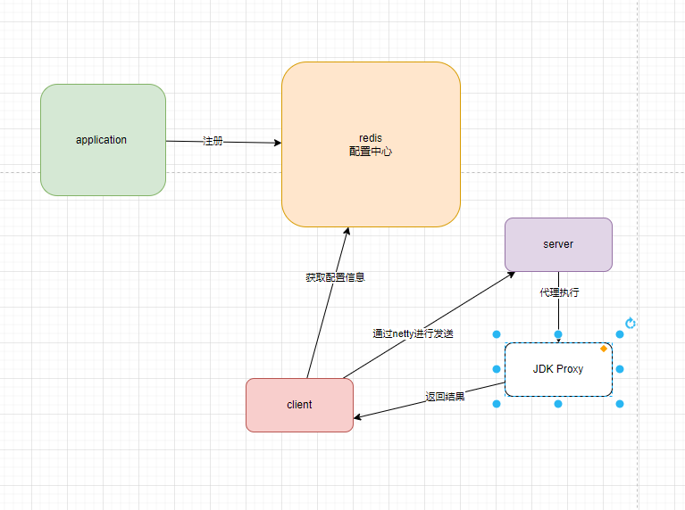

基本的流程如下



主要还是通过netty去实现整个rpc的调用，配置中心可以选择其他的，zk、或者其他分布式，一个服务就行，然后从该服务上获取信息，让netty客户端进行对channel发送，发送完成之后在返回，其中我自己定义了一些序列化handler进行处理数据。

## 配置加载
配置加载主要放到spring中进行，定义一些基本的beanRegistry以及实现ApplicationContextAware在初始化的时候进行对应的加载。

最终统一交给一个注解@EnableRpc
```java
@Retention(RetentionPolicy.RUNTIME)
@Target(ElementType.FIELD)
@Import(ServerAutoConfigure.class)
@EnableConfigurationProperties(ServerProperties.class)
@ComponentScan("cn.kevinwang.rpc.*")
public @interface EnableRpc {
}
```

完成基本的配置.